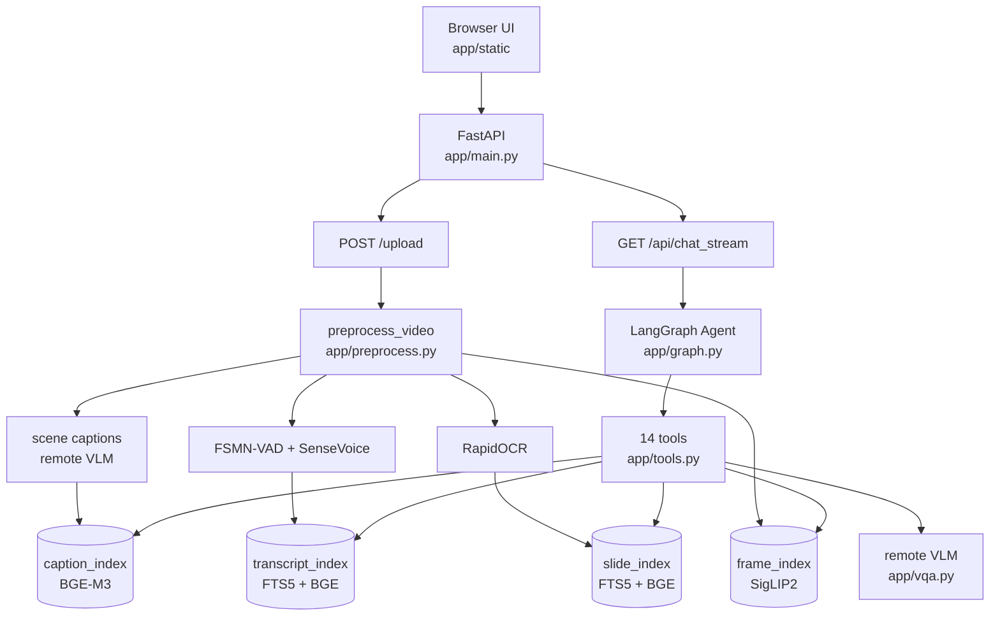

# Mr. Big-Eye

面向长视频音画问答 Agent 的 **训练、蒸馏、评测与推理系统**。

项目当前重点是训练侧：把成熟的长视频 QA Agent 当作 teacher，采集它在评测集上的完整工具调用轨迹，再把这些轨迹整理成 Agentic SFT 数据，训练一个更便宜、可本地部署的 orchestrator student。推理侧仍然保留完整 Web 应用、离线视频索引、LangGraph Agent、工具调用和评测 harness。

一句话说：

> Mr. Big-Eye 不是把整段视频直接塞给一个大模型，而是先把长视频离线变成可检索证据库，再让 Agent 在线调工具查证、观察、对齐、回答；训练侧则蒸馏这个 Agent 的工具调用策略。

---

## 项目主线

### 训练侧：Agentic SFT / Orchestrator Distillation

训练目标不是 VLM 的视觉能力，而是 **orchestrator 的决策能力**：

- 输入：system prompt、用户问题、历史工具结果、证据状态。
- 输出：下一步 tool call，或最终 answer。
- 不训练：BGE/SigLIP 检索模型、ASR/OCR、远程 VLM 的看图能力。

完整路线：

```text
Phase 0  数据与视频索引准备
Phase A  teacher 轨迹采集：跑现有 Agent，保存完整 messages / system_prompt / guards
Phase B  过滤与格式化：Tier 分类、按视频切 train/val、切成每一步 SFT 样本
Phase C  LoRA SFT：Qwen2.5-7B-Instruct + PEFT，completion-only loss
Phase D  部署评测：vLLM serve LoRA，用 held-out 视频对比 teacher / baseline
```

### 推理侧：Long-video Multimodal QA Agent

推理路径仍是完整的长视频 QA 系统：

1. 上传或导入视频。
2. 离线抽取场景帧、稠密帧、字幕、PPT/OCR 文本。
3. 建立 BGE-M3 文本索引和 SigLIP2 图文帧索引。
4. LangGraph orchestrator 调用 14 个工具检索、观察、对齐和回答。
5. 最终答案必须带证据引用，如 `[FRAME:t=12.3]`、`[TRANSCRIPT:t=10.0-14.0]`、`[SLIDE:t=72.0]`。

---

## 当前状态

| 项 | 状态 |
| --- | --- |
| Agent 版本 | `AGENT_CODE_VERSION = "v22"` |
| 注册工具 | 14 个，见 `app/tools.py:TOOLS` |
| 训练/蒸馏文档 | `distillation_spec.md` |
| Teacher 轨迹采集 | `scripts/eval_harness.py --save-full-trajectory` |
| SFT 数据构建 | `scripts/distill_build_dataset.py` |
| SFT 训练 | `scripts/distill_train.py` |
| Student 部署 | `scripts/distill_serve_vllm.sh` |
| Video-MME manifest | `eval/audiovisual/video_manifest.json`，当前 247 个视频 |
| Eval cases | `questions.ready.jsonl` 199 题；`questions.new_short.jsonl` 594 题；`questions.jsonl` 741 题 |

当前分支已经具备从 teacher 采集到 student 评测的闭环脚本。`distillation_spec.md` 是训练侧更细的工程说明；README 负责给出可执行主流程。

---

## 训练侧核心概念

### Teacher 和 Student

Teacher 是当前线上 Agent：通常由远程 tool-call 文本模型做 orchestrator，远程 VLM 负责 caption、局部观察和最终视觉理解。

Student 是要训练出来的本地 orchestrator：它学习 teacher 何时调用哪个工具、带什么参数、何时认为证据足够、何时回答。Student 部署后，VLM 和检索栈可以保持不变，这样 Phase D 对比时只改变 orchestrator 这一项。

### 为什么只蒸馏 Orchestrator

长视频任务里的成本和不稳定性不只来自“看图”，还来自 Agent 的编排：

- 先搜画面还是先搜字幕？
- MCQ 题要不要建立候选时间线？
- 语音和画面矛盾时要不要 `align_audiovisual_evidence`？
- 证据不足时是扩窗、找 slide，还是直接回答？
- grounding 失败时如何 revise？

这些是 tool-call policy，适合用 teacher 轨迹做 SFT。

### 工具动作空间

当前 orchestrator 可调用 14 个工具：

```text
retrieve_video_evidence
retrieve_transcript_evidence
search_transcript_keyword
retrieve_slide_evidence
align_audiovisual_evidence
build_timeline
retrieve_hypothesis_evidence
segment_focus
expand_temporal_evidence
stitched_verify
assess_evidence_sufficiency
answer_with_evidence
verify_grounding
search_user_memories
```

训练数据必须和这份 schema 同源。`scripts/distill_build_dataset.py` 会通过 `app.distill_format.export_tool_schemas()` 导出 `data/distillation/tool_schemas.json`。

---

## 快速开始

### 1. 安装依赖

```bash
pip install -r requirements.txt
```

如果要训练 LoRA，还需要 CUDA 版 PyTorch、`transformers`、`peft`、`bitsandbytes`，以及可选的 `liger-kernel`、`wandb`。如果要用 vLLM 部署 student，需要单独准备 vLLM 环境。

### 2. 配置 `.env`

最少需要远程 VLM 配置：

```bash
cp .env.example .env
```

常用字段：

| 变量 | 用途 |
| --- | --- |
| `VLM_API_BASE_URL` | VLM / caption / observer / answer API |
| `VLM_API_KEY` | VLM API key |
| `VLM_MODEL_NAME` | VLM 模型名 |
| `VLM_API_FORMAT` | `responses` 或 `chat_completions` |
| `ORCHESTRATOR_API_BASE_URL` | tool-call orchestrator API；留空则复用 VLM API |
| `ORCHESTRATOR_API_KEY` | orchestrator key |
| `ORCHESTRATOR_MODEL_NAME` | orchestrator 模型名 |
| `JUDGE_API_BASE_URL` | eval judge API |
| `JUDGE_API_KEY` | eval judge key |
| `JUDGE_MODEL_NAME` | judge 模型名 |
| `MODELS_DEVICE` | 本地 BGE/SigLIP 默认设备，如 `cuda:0` |

### 3. 下载本地检索模型

```bash
python scripts/download_models.py
```

本地模型只负责索引和检索：

- BGE-M3：caption、字幕、PPT/OCR 文本向量。
- SigLIP2：图文帧检索。
- SenseVoice + FSMN-VAD：ASR。
- RapidOCR：PPT、白板、屏幕文字识别。

VLM 不在本地下载，由远程 API 提供。

---

## Phase 0：数据和视频索引

### 下载 Video-MME

完整 Video-MME 视频集约 100GB，脚本支持断点续传和解压：

```bash
python scripts/download_videomme_full.py
```

如果已经下载 zip，只想解压：

```bash
python scripts/download_videomme_full.py --skip-download
```

### 抽样构建训练候选视频

从 Video-MME 中抽样目标视频集，保留已有 manifest 里的视频，继续补到目标数量：

```bash
python scripts/sample_videomme.py --target 250 --buckets short,medium,long
```

偏低成本试跑可以只取短视频：

```bash
python scripts/sample_videomme.py --target 250 --buckets short
```

### 构建 audiovisual eval cases

```bash
python scripts/build_videomme_eval.py
python scripts/build_supplementary_eval.py
```

关键产物：

```text
eval/audiovisual/video_manifest.json
eval/audiovisual/questions.jsonl
eval/audiovisual/questions.ready.jsonl
eval/audiovisual/questions.new_short.jsonl
```

### 批量 ingest 视频

单进程：

```bash
python -m scripts.ingest_videomme
```

4 GPU 并行：

```bash
scripts/run_ingest_4gpu.sh mbe-ingest 0,1,2,3
```

ingest 会把每个视频变成离线缓存：

```text
data/cache/{video_id}/
├── meta.json
├── .done
├── frames_scene/
├── frames_dense/
├── captions.jsonl
├── transcripts.jsonl
├── subtitles.vtt
├── slides.jsonl
├── caption_index/
├── frame_index/
├── transcript_index/
└── slide_index/
```

---

## Phase A：采集 Teacher 轨迹

Teacher 轨迹来自 `scripts/eval_harness.py`。开启 `--save-full-trajectory` 后，每个 case 会保存：

- `system_prompt`
- 完整 `messages`
- tool calls / tool results
- `guards_triggered`
- `agent_terminated`
- judge 结果
- retrieval / answer / agent 分项评分

单进程采集：

```bash
python scripts/eval_harness.py \
  --cases eval/audiovisual/questions.ready.jsonl \
  --output data/distillation/teacher_report.json \
  --save-full-trajectory \
  --trajectory-out data/distillation/raw_trajectories/teacher_$(date +%Y%m%d).jsonl \
  --judge \
  --judge-cache data/distillation/judge_cache_teacher.jsonl \
  --prediction-cache data/distillation/pred_cache_teacher.jsonl
```

4 GPU 并行采集需要先把 cases 切成：

```text
data/distillation/teacher_shards/cases_0.jsonl
data/distillation/teacher_shards/cases_1.jsonl
data/distillation/teacher_shards/cases_2.jsonl
data/distillation/teacher_shards/cases_3.jsonl
```

然后运行：

```bash
scripts/run_teacher_4gpu.sh mbe-ingest 0,1,2,3 0.0
```

每个 shard 会写：

```text
data/distillation/teacher_shards/traj_{i}.jsonl
data/distillation/teacher_shards/report_{i}.json
data/distillation/teacher_shards/log_{i}.log
```

合并轨迹：

```bash
mkdir -p data/distillation/raw_trajectories
cat data/distillation/teacher_shards/traj_*.jsonl \
  > data/distillation/raw_trajectories/teacher_merged.jsonl
```

验收 Phase A：

```bash
python scripts/distill_validate_phase_a.py \
  --trajectories data/distillation/raw_trajectories/teacher_merged.jsonl \
  --expected 199 \
  --out data/distillation/phase_a_report.md
```

---

## Phase B：过滤和构建 SFT 数据

Phase B 做四件事：

1. 重新计算 guards，避免旧采集逻辑影响分层。
2. Tier 过滤：默认只保留 `tier_1` teacher 正例。
3. 按 `video_id` 切 train/val，避免同一视频泄漏到两个 split。
4. 把一条完整轨迹切成多个“前缀 -> 下一条 assistant 决策”样本。

构建数据：

```bash
python scripts/distill_build_dataset.py \
  --trajectories data/distillation/raw_trajectories/teacher_merged.jsonl \
  --cases eval/audiovisual/questions.ready.jsonl \
  --out-dir data/distillation \
  --val-ratio 0.2 \
  --seed 0
```

输出：

```text
data/distillation/train.jsonl
data/distillation/val.jsonl
data/distillation/eval_heldout.jsonl
data/distillation/tool_schemas.json
data/distillation/build_dataset_report.json
```

验收 Phase B：

```bash
python scripts/distill_validate_phase_b.py \
  --train data/distillation/train.jsonl \
  --val data/distillation/val.jsonl \
  --tokenizer /path/to/Qwen2.5-7B-Instruct \
  --out data/distillation/phase_b_report.md
```

需要特别注意：

- forced call target 会被排除，因为它们是 runtime 注入，不是 teacher 策略。
- 原始 base64 图像会被截断或替换，避免训练样本爆长。
- 工具结果保留文本和结构信息，让 student 学会基于证据继续决策。

---

## Phase C：训练 Student Orchestrator

训练脚本是自包含 PEFT trainer：

```bash
CUDA_VISIBLE_DEVICES=0 python scripts/distill_train.py \
  --model /path/to/Qwen2.5-7B-Instruct \
  --train data/distillation/train.jsonl \
  --val data/distillation/val.jsonl \
  --output-dir data/distillation/ckpt_mrbigeye_orch \
  --epochs 3 \
  --batch-size 1 \
  --grad-accum 32 \
  --cutoff-len 6144 \
  --lora-rank 32 \
  --lora-alpha 64 \
  --lora-dropout 0.05 \
  --lr 1e-4 \
  --load-4bit \
  --use-liger \
  --wandb \
  --run-name mrbigeye-orch-sft
```

`scripts/distill_train.py` 使用模型自己的 chat template 渲染 tool calls，并且只对最后一条 assistant message 计算 loss。前缀里的 system、user、assistant 历史和 tool results 都被 mask 掉。

这里没有使用 LLaMA-Factory 的原因是：orchestrator 可能在同一轮输出并行 tool calls，而常见 function-call 数据格式只支持单个 function call。

训练成功后，checkpoint 目录应包含：

```text
adapter_model.safetensors
adapter_config.json
tokenizer_config.json
```

---

## Phase D：部署和评测 Student

用 vLLM 起本地 OpenAI-compatible orchestrator：

```bash
scripts/distill_serve_vllm.sh \
  /path/to/Qwen2.5-7B-Instruct \
  data/distillation/ckpt_mrbigeye_orch \
  1 \
  8001
```

另一个终端里把 orchestrator 指向 student，VLM 和 judge 保持 teacher 时的配置：

```bash
ORCHESTRATOR_API_BASE_URL=http://127.0.0.1:8001/v1 \
ORCHESTRATOR_API_KEY=EMPTY \
ORCHESTRATOR_MODEL_NAME=mrbigeye_orch \
python scripts/eval_harness.py \
  --cases data/distillation/eval_heldout.jsonl \
  --output data/distillation/student_heldout.json \
  --judge \
  --judge-cache data/distillation/judge_cache_student.jsonl \
  --prediction-cache data/distillation/pred_cache_student.jsonl
```

同一 held-out 集再跑 teacher/baseline：

```bash
python scripts/eval_harness.py \
  --cases data/distillation/eval_heldout.jsonl \
  --output data/distillation/baseline_heldout.json \
  --judge \
  --judge-cache data/distillation/judge_cache_baseline.jsonl \
  --prediction-cache data/distillation/pred_cache_baseline.jsonl
```

汇总对比：

```bash
python scripts/distill_compare_runs.py \
  --student data/distillation/student_heldout.json \
  --baseline data/distillation/baseline_heldout.json \
  --out data/distillation/phase_d_report.md
```

主要看：

- pass rate 是否接近 teacher。
- tool calls / case 是否异常升高或降低。
- guard 触发分布是否异常。
- student 单 case orchestrator 成本是否显著下降。

---

## 推理侧 Agent 架构

### 系统组成



### 请求链路

上传视频后，`app/preprocess.py` 会生成多种证据：

- 场景 caption：粗定位视频段落。
- 稠密关键帧：找物体、动作、画面细节。
- transcript：找对白、讲解、声音事件。
- slide/OCR：找标题、公式、屏幕文字、PPT 页面。

用户提问时，`app/graph.py` 的 LangGraph orchestrator 会根据问题类型决定工具调用顺序。最终答案由 `answer_with_evidence` 生成，再由 `verify_grounding` 校验引用。

### 视觉和文本检索

视觉检索是两阶段：

1. BGE-M3 根据问题检索 scene captions，得到候选时间窗。
2. SigLIP2 在候选时间窗和全局帧中混合检索关键帧。

文本检索是 sparse + dense 融合：

- SQLite FTS5 做关键词召回。
- BGE-M3 dense index 做语义召回。
- RRF 融合 transcript 和 slide 命中。

这种设计避免把整段长视频塞给 VLM，同时让 Agent 能围绕证据逐步查证。

### Web 应用

启动：

```bash
python scripts/launch_app.sh
```

或直接：

```bash
uvicorn app.main:app --host 0.0.0.0 --port 8000
```

主要 API：

| API | 用途 |
| --- | --- |
| `POST /upload` | 上传视频并启动预处理 |
| `GET /api/preprocess_stream/{video_id}` | SSE 预处理进度 |
| `GET /api/chat_stream` | SSE Agent 回答 |
| `POST /chat` | legacy direct path，不是完整 Agent 主路径 |
| `POST /api/login` | 简易用户登录 |
| `GET /api/sessions` | 会话列表 |
| `GET /api/videos` | 视频列表 |

---

## Agent 评测

常规 audiovisual eval：

```bash
python scripts/eval_harness.py \
  --cases eval/audiovisual/questions.ready.jsonl \
  --output data/eval/audiovisual_report.json \
  --judge \
  --judge-cache data/eval/judge_cache.jsonl \
  --prediction-cache data/eval/prediction_cache.jsonl
```

抽样 smoke：

```bash
python scripts/eval_harness.py \
  --cases eval/audiovisual/questions.ready.jsonl \
  --sample 20 \
  --sample-seed 0 \
  --output data/eval/smoke20.json \
  --judge
```

评测报告会写 JSON 和 Markdown，并追加 `data/eval/runs_index.csv`，方便横向比较不同 orchestrator、VLM、prompt fingerprint 和 Agent 版本。

缓存 key 包含：

- case id
- orchestrator model
- VLM model
- prompt fingerprint
- video id
- `AGENT_CODE_VERSION`

如果改了 prompt，fingerprint 会自动变化；如果改了 prompt 外的 runtime 行为，请手动 bump `app/eval_fingerprint.py` 里的版本。

---

## 目录结构

```text
app/
  graph.py                 # LangGraph Agent、orchestrator prompt、guards
  tools.py                 # 14 个工具和工具 schema
  vqa.py                   # 远程 VLM client
  preprocess.py            # 视频离线预处理
  retrieval.py             # caption/frame 检索
  text_assets.py           # transcript/slide FTS + dense index
  distill_*.py             # 训练数据过滤、格式化、轨迹工具

scripts/
  eval_harness.py          # Agent 评测 + teacher 轨迹采集
  distill_build_dataset.py # Phase B
  distill_train.py         # Phase C
  distill_serve_vllm.sh    # Phase D serve
  distill_compare_runs.py  # student vs baseline
  run_ingest_4gpu.sh       # 多 GPU ingest
  run_teacher_4gpu.sh      # 多 GPU teacher 采集
  build_videomme_eval.py
  build_supplementary_eval.py

eval/audiovisual/
  video_manifest.json
  questions.jsonl
  questions.ready.jsonl
  questions.new_short.jsonl

data/
  uploads/                 # 视频文件，按 video_id 命名
  cache/                   # 预处理缓存和索引
  distillation/            # teacher 轨迹、SFT 数据、训练/评测报告
  eval/                    # 普通评测报告和缓存

tests/
  test_distill_*.py
  test_eval_harness.py
  test_graph_orchestrator.py
  test_tools_planner.py
```

`data/`、`models/`、`wandb/` 默认不进 Git。

---

## 测试

训练侧相关测试：

```bash
pytest \
  tests/test_distill_format.py \
  tests/test_distill_filter.py \
  tests/test_distill_truncate.py \
  tests/test_distill_trajectory.py \
  tests/test_eval_harness.py
```

Agent / 推理侧关键测试：

```bash
pytest \
  tests/test_graph_orchestrator.py \
  tests/test_tools_planner.py \
  tests/test_retrieval.py \
  tests/test_eval_harness.py \
  tests/test_main_stream_contract.py
```

全量：

```bash
pytest
```

---

## 常见坑

### Teacher 轨迹没有 messages

如果 prediction cache 是旧的，里面可能没有完整 message stream。采集时打开 `--save-full-trajectory` 后，脚本会把这类 cache hit 当成 stale miss 重新跑。建议 distillation 用独立 cache：

```text
data/distillation/pred_cache_teacher.jsonl
```

### 同一视频泄漏到 train 和 eval

不要随机按样本切分。必须按 `video_id` 切分，因为同一个视频通常有多道题。`scripts/distill_build_dataset.py` 已经按视频切 train/val，并输出 `eval_heldout.jsonl`。

### Student 会学到 forced call

不要把 runtime 注入的 `force_answer_with_evidence`、`force_verify_grounding` 当 teacher target。`app.distill_format` 已经排除这些 target。

### vLLM tool call 解析失败

`scripts/distill_serve_vllm.sh` 使用：

```text
--enable-auto-tool-choice
--tool-call-parser hermes
```

如果换 base model 或 chat template，先做小样本 smoke，确认它能输出合法 OpenAI tool calls。

### 低显存

训练时优先使用：

```text
--load-4bit --use-liger --batch-size 1 --grad-accum 32
```

评测或 Web 推理时，可以设置：

```text
LOAD_MODELS_ON_STARTUP=false
UNLOAD_MODELS_AFTER_USE=true
```

### 改了工具 schema

工具 schema 是训练数据的动作空间。修改 `app/tools.py:TOOLS` 后，旧的 `tool_schemas.json` 和旧 SFT 数据都需要重建。

---

## English TL;DR

Mr. Big-Eye is a long-video audiovisual QA Agent and an orchestrator-distillation training pipeline. The inference system indexes videos into scene captions, dense frames, transcripts, and slide/OCR text, then lets a LangGraph Agent call 14 tools to retrieve evidence, inspect local windows, align audio with visuals, answer, and verify grounding.

The training focus is Agentic SFT: collect full teacher trajectories with `scripts/eval_harness.py --save-full-trajectory`, filter and slice them with `scripts/distill_build_dataset.py`, train a Qwen2.5 LoRA orchestrator with `scripts/distill_train.py`, serve it through vLLM, and compare it against the teacher on held-out videos.
